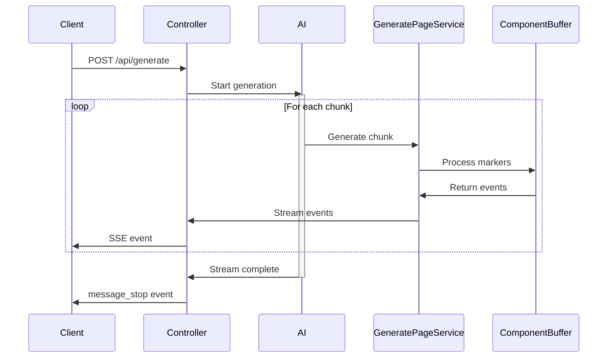

# Component Streaming Architecture

## Overview
The component streaming system is designed to efficiently generate and deliver React components from the AI to the frontend in real-time. This document outlines the streaming architecture and how components are processed and delivered.

## System Flow

### Sequence Diagram


## System Components

### 1. AI Stream
- Generates raw text content
- Includes component markers and code
- Delivered in chunks through the stream

### 2. Backend Processing Pipeline
```
AI Stream → GeneratePageService → GeneratorState → ComponentBuffer → SSE Events
```

#### GeneratePageService
- Entry point for stream processing
- Handles chunk parsing and error management
- Coordinates the generation process
- Manages timeouts and statistics

#### GeneratorState
- Processes text for component markers
- Tracks component state and nesting
- Manages compound components
- Generates events for frontend

#### ComponentBuffer
- Temporary storage for components
- Handles size limits and validation
- Tracks component metadata
- Manages component lifecycle

### 3. Server-Sent Events (SSE)
The system uses SSE to stream components to the frontend in real-time.

## Component Lifecycle

### 1. Component Start
When a START marker is detected:
```javascript
/// START ComponentName position=position
```
- ComponentBuffer creates new component
- Start event sent to frontend
- Frontend prepares for component content

### 2. Content Generation
As content is generated:
- Content is buffered and validated
- Delta events sent to frontend
- Frontend updates component in real-time

### 3. Component Completion
When END marker is detected:
```javascript
/// END ComponentName
```
- Component marked as complete
- Stop event sent to frontend
- Frontend finalizes component

## Streaming Protocol

### Event Types

#### 1. Content Events
- **content_block_start**: New component beginning
- **content_block_delta**: Component content update
- **content_block_stop**: Component completion

#### 2. Status Events
- **status**: Generation progress updates
- **error**: Error notifications
- **message_stop**: Stream completion

### Event Flow Control
1. Events are sent in order of generation
2. Frontend processes events sequentially
3. Error events may interrupt normal flow
4. Status events provide progress updates

## Error Handling

### 1. Parse Errors
- Invalid JSON in stream
- Malformed markers
- Invalid component structure

### 2. Size Management
- Component size limits
- Buffer overflow protection
- Content trimming when needed

### 3. Timeout Protection
- Generation timeout (30s default)
- Chunk processing timeouts
- Client disconnect handling

## Performance Considerations

### 1. Memory Management
- Components buffered temporarily
- Size limits enforced
- Cleanup on completion

### 2. Stream Efficiency
- Chunked delivery
- Incremental updates
- Minimal payload size

### 3. Frontend Updates
- Real-time rendering
- Progressive enhancement
- Smooth user experience

## Security Measures

### 1. Input Validation
- Marker validation
- Component name checks
- Position validation

### 2. Size Limits
- Maximum component size
- Maximum number of components
- Content trimming rules

### 3. Error Thresholds
- Parse error limits
- Error window tracking
- Automatic cleanup

## Frontend Integration

### 1. Event Handling
```javascript
eventSource.addEventListener('message', (event) => {
  const data = JSON.parse(event.data);
  switch (data.type) {
    case 'content_block_start':
      // Initialize component
      break;
    case 'content_block_delta':
      // Update component
      break;
    case 'content_block_stop':
      // Finalize component
      break;
  }
});
```

### 2. Component Management
- Dynamic component creation
- Real-time updates
- Completion handling

### 3. Error Recovery
- Retryable error handling
- Graceful degradation
- User feedback

## Future Enhancements

### 1. Performance
- Batch updates optimization
- Compression for large components
- Caching strategies

### 2. Reliability
- Enhanced error recovery
- Automatic reconnection
- Progress persistence

### 3. Features
- Component dependencies
- Nested streaming
- Progressive loading

## SSE Implementation Details

### Backend Setup
```javascript
// Controller setup
app.get('/api/generate', (req, res) => {
  // Set SSE headers
  res.setHeader('Content-Type', 'text/event-stream');
  res.setHeader('Cache-Control', 'no-cache');
  res.setHeader('Connection', 'keep-alive');
  res.setHeader('Access-Control-Allow-Origin', '*');
  
  // Optional compression
  res.setHeader('Content-Encoding', 'none');
  
  // Ensure headers are sent
  res.flushHeaders();
  
  // Start generation...
});
```

### Frontend Setup
```javascript
class ComponentStream {
  constructor(projectId, versionId) {
    this.eventSource = new EventSource(
      `/api/generate?projectId=${projectId}&versionId=${versionId}`
    );
    
    // Handle connection
    this.eventSource.onopen = () => {
      console.log('SSE connection established');
    };
    
    // Handle errors
    this.eventSource.onerror = (error) => {
      console.error('SSE error:', error);
      this.reconnect();
    };
    
    // Setup event handlers
    this.setupEventHandlers();
  }
  
  setupEventHandlers() {
    this.eventSource.addEventListener('message', this.handleMessage);
    this.eventSource.addEventListener('error', this.handleError);
    // ... other handlers
  }
  
  reconnect() {
    // Implement reconnection logic
  }
}
```

## Security Implementation

### Authentication
```javascript
// Middleware for SSE authentication
const authenticateSSE = async (req, res, next) => {
  const token = req.headers.authorization?.split(' ')[1];
  if (!token) {
    return res.status(401).json({ error: 'No token provided' });
  }
  
  try {
    const decoded = jwt.verify(token, process.env.JWT_SECRET);
    req.user = decoded;
    next();
  } catch (error) {
    res.status(401).json({ error: 'Invalid token' });
  }
};

// Apply to routes
app.get('/api/generate', authenticateSSE, generateController);
```

### Rate Limiting
```javascript
const rateLimiter = rateLimit({
  windowMs: 15 * 60 * 1000, // 15 minutes
  max: 100, // Limit each IP to 100 requests per windowMs
  message: 'Too many requests from this IP'
});

app.use('/api/generate', rateLimiter);
```

### Content Validation
- All component markers are validated against XSS
- Code content is sanitized before streaming
- Size limits are enforced per component and total
- Malicious pattern detection in generated code

## Monitoring and Debugging

### Logging
```javascript
// Component generation logging
const logComponentGeneration = (component) => {
  logger.info('Component generated', {
    name: component.name,
    size: component.code.length,
    timestamp: new Date(),
    metadata: component.metadata
  });
};

// Error logging
const logStreamError = (error) => {
  logger.error('Stream error', {
    code: error.code,
    message: error.message,
    stack: error.stack,
    timestamp: new Date()
  });
};
```

### Metrics
- Component generation time
- Stream connection duration
- Error rates and types
- Component size distribution
- Client reconnection frequency

### Debug Mode
```javascript
// Enable debug mode with query parameter
if (req.query.debug === 'true') {
  res.write(`data: ${JSON.stringify({
    type: 'debug',
    timestamp: Date.now(),
    state: service.getDebugState()
  })}\n\n`);
}
``` 