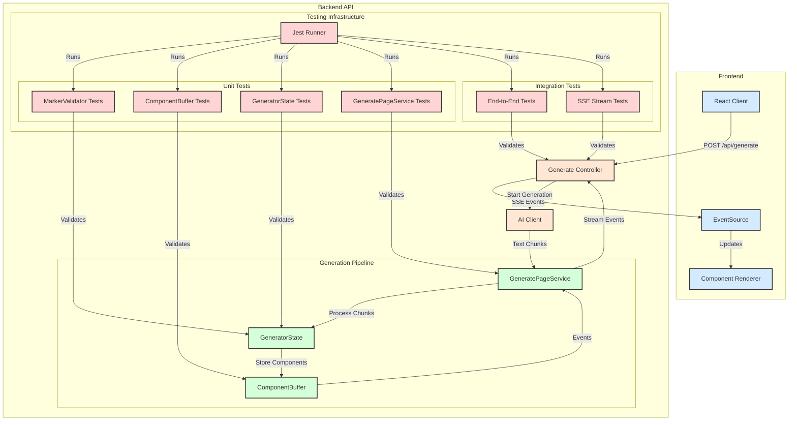
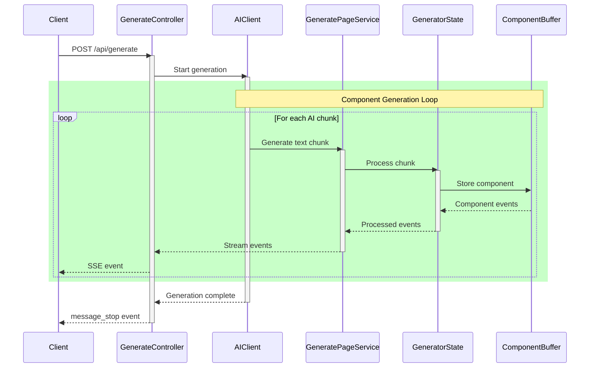
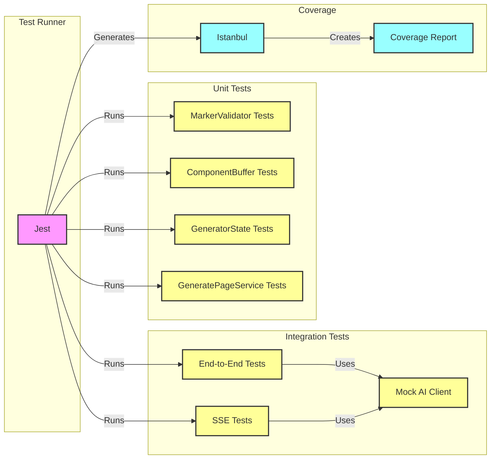
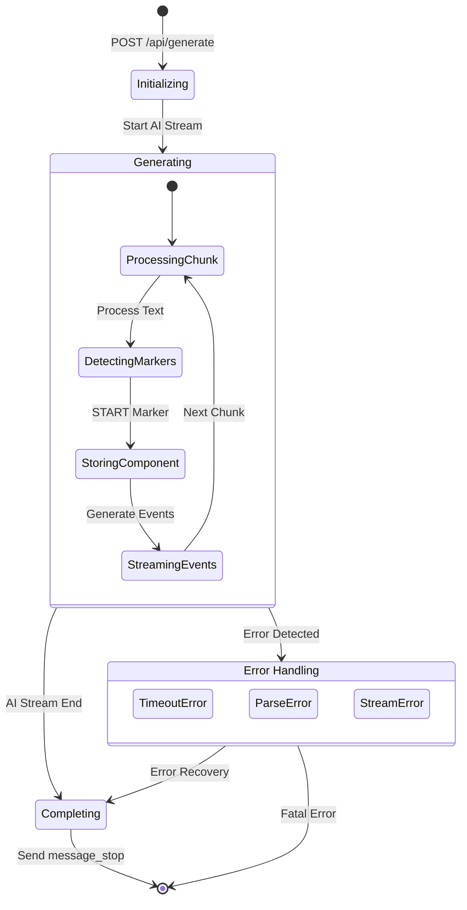

# System Architecture

## Component Generation and Testing Flow

## Component Processing Sequence

## Testing Architecture

## Event Flow

These diagrams illustrate:
1. The overall system architecture and component relationships
2. The detailed sequence of component generation and streaming
3. The testing infrastructure and coverage reporting
4. The state flow of the event generation system

Key aspects highlighted:
- Frontend-Backend communication via SSE
- Component generation pipeline
- Test coverage and organization
- Error handling and recovery paths
- State management and transitions 